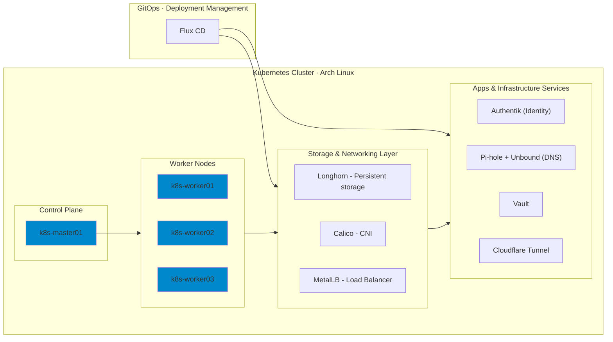

My personal bare-metal Kubernetes homelab, managed with Flux GitOps and slowly optimized as an enterprise grade instance. Focus on core services and later on hardening the services and having meaningful observability on top.
## Architecture

## Hardware

4× HP EliteDesk 800 G9 Mini PC — Intel i5-12600 · 16 GB RAM · 256 GB NVMe · Arch Linux

| Node          | Role          |
|---------------|---------------|
| k8s-master01  | Control Plane |
| k8s-worker01  | Worker        |
| k8s-worker02  | Worker        |
| k8s-worker03  | Worker        |

## Repo layout

- `clusters/k8s-homelab` — cluster entrypoint + Flux bootstrap
- `infra` — shared platform components (vault, monitoring, external-secrets, etc.)
- `services` — core services (DNS, storage, LB, identity, tunnel)
- `apps` — user workloads (`linkding`, `n8n`, `termix`)
- `scripts` — host/bootstrap helper scripts

## Stack

| Component      | Current in repo                     | Roadmap |
|----------------|-------------------------------------|---------|
| OS             | Arch Linux                          | —       |
| CNI            | Calico                              | Cilium  |
| GitOps         | Flux (Kustomize + HelmRelease)      | —       |
| LB             | MetalLB                             | kube-vip (planned) |
| Storage        | Longhorn                            | —       |
| DNS            | Pi-hole + Unbound                   | —       |
| Secrets        | Vault + External Secrets            | —       |
| Identity       | Authentik                           | —       |
| Tunnel         | Cloudflare Tunnel                   | —       |
| Monitoring     | kube-prometheus-stack + metrics-server | —    |

