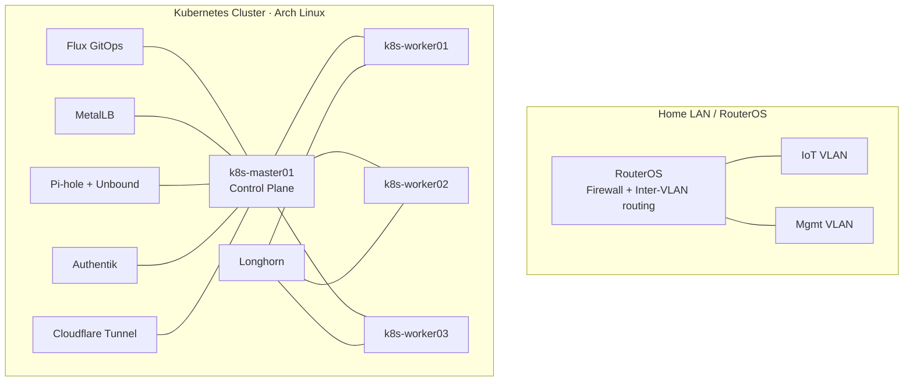

# homelabs

Personal bare-metal Kubernetes homelab, managed with Flux GitOps.

## Hardware

4× HP EliteDesk 800 G9 Mini PC — Intel i5-12600 · 16 GB RAM · 256 GB NVMe · Arch Linux

| Node          | Role          |
|---------------|---------------|
| k8s-master01  | Control Plane |
| k8s-worker01  | Worker        |
| k8s-worker02  | Worker        |
| k8s-worker03  | Worker        |

## Repo layout

- `clusters/k8s-homelab` — cluster entrypoint + Flux bootstrap
- `infra` — shared platform components (vault, monitoring, external-secrets, etc.)
- `services` — core services (DNS, storage, LB, identity, tunnel)
- `apps` — user workloads (`linkding`, `n8n`, `termix`)
- `scripts` — host/bootstrap helper scripts

## Stack

| Component      | Current in repo                     | Roadmap |
|----------------|-------------------------------------|---------|
| OS             | Arch Linux                          | —       |
| GitOps         | Flux (Kustomize + HelmRelease)      | —       |
| LB             | MetalLB                             | kube-vip (planned) |
| Storage        | Longhorn                            | —       |
| DNS            | Pi-hole + Unbound                   | —       |
| Secrets        | Vault + External Secrets            | —       |
| Identity       | Authentik                           | —       |
| Tunnel         | Cloudflare Tunnel                   | —       |
| Monitoring     | kube-prometheus-stack + metrics-server | —    |

## Architecture

