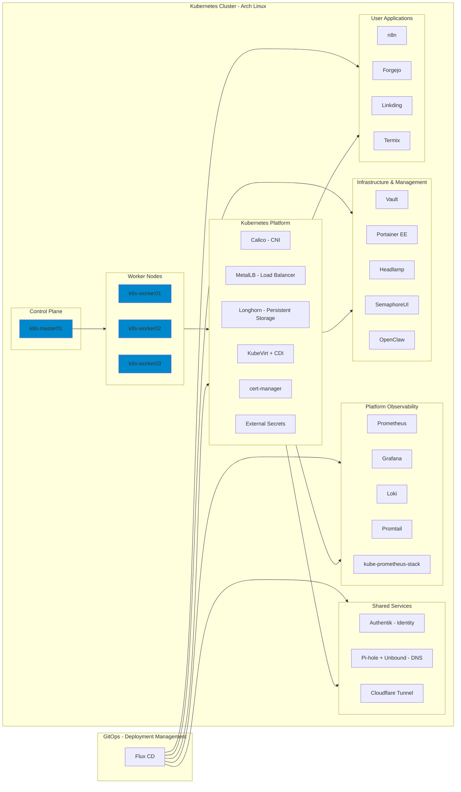

My personal bare-metal Kubernetes homelab, managed with Flux GitOps and slowly optimized as an enterprise-grade instance. The focus is on a clear Kubernetes platform layer, secure shared services, workload isolation, lifecycle management, and meaningful observability.

## Architecture

## Hardware

4x HP EliteDesk 800 G9 Mini PC - Intel i5-12600 - 16 GB RAM - 256 GB NVMe - Arch Linux

| Node | Role |
|---|---|
| k8s-master01 | Control Plane |
| k8s-worker01 | Worker |
| k8s-worker02 | Worker |
| k8s-worker03 | Worker |

## Repository model

The repository is organized by architectural responsibility rather than by installation mechanism.

> **`platform/` makes Kubernetes work. `infra/`, `services/`, and `workloads/` run on or consume the platform.**

- `clusters/k8s-homelab` - cluster entrypoint and reconciliation wiring.
- `platform` - Kubernetes system capabilities: networking, storage, virtualization, observability, and cluster security controllers.
- `infra` - shared infrastructure and management components that run on the platform, such as Vault, Kong, Headlamp, Portainer, SemaphoreUI, OpenClaw, and AI tooling.
- `services` - shared runtime services consumed by clients or workloads, currently DNS, identity, and tunnel services.
- `workloads/apps` - application workloads.
- `workloads/vms` - KubeVirt virtual-machine workloads.
- `automation` - Ansible, Terraform, and operational automation.
- `scripts` - host/bootstrap and validation helpers.
- `docs` - architecture, lifecycle, and operating documentation.

See [`docs/repository-layout.md`](docs/repository-layout.md) for the classification rules and GitOps ownership model.

## Platform stack

| Capability | Current implementation | Roadmap |
|---|---|---|
| OS | Arch Linux | - |
| CNI | Calico | Cilium |
| GitOps | Flux CD (Kustomize + HelmRelease) | - |
| Load Balancer | MetalLB | kube-vip planned |
| Persistent Storage | Longhorn | - |
| Local VM Storage | local-path-provisioner | - |
| Virtualization | KubeVirt + CDI | - |
| Cluster DNS | CoreDNS | - |
| Certificates | cert-manager | - |
| External Secrets | External Secrets Operator | - |
| Monitoring | kube-prometheus-stack + metrics-server | - |
| Observability | Grafana + Prometheus + Loki + Promtail | - |

## Shared services and management

| Component | Role |
|---|---|
| Pi-hole + Unbound | LAN DNS filtering and encrypted upstream DNS |
| Authentik | Identity provider |
| Cloudflare Tunnel | External publication path |
| Vault | Secrets backend |
| Kong | API/ingress gateway |
| Headlamp | Kubernetes dashboard |
| Portainer EE | Container management |
| SemaphoreUI | Automation UI |
| OpenClaw | AI operations agent |

## Lifecycle management

A Renovate GitHub Action and lifecycle automation keep the homelab current. Kubernetes platform upgrades are intentionally gated and documented under `docs/lifecycle/`; critical components retain dedicated Flux `Kustomization` objects so repository refactoring does not change their safety or persistence behavior.
