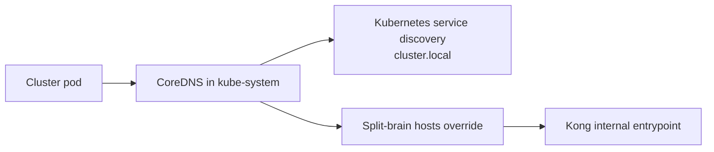
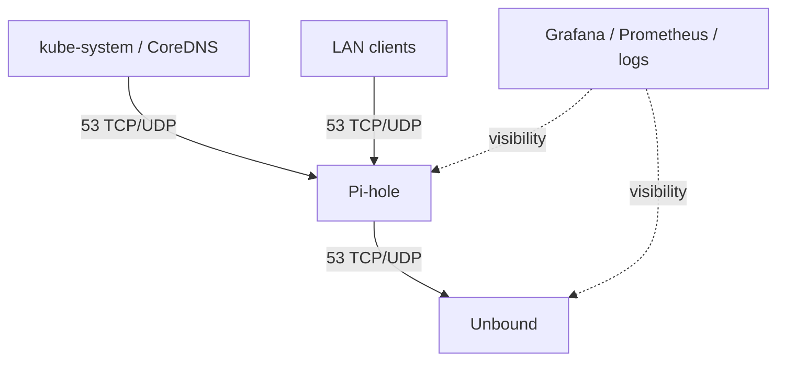
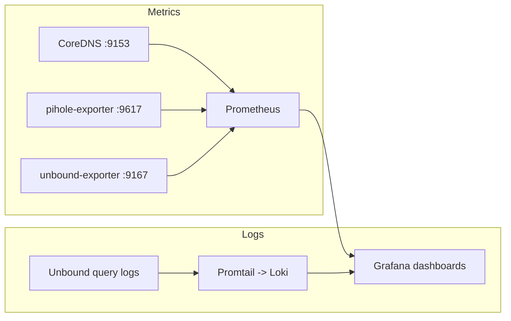

# DNS Architecture

This document describes how DNS works in this homelab for Kubernetes workloads and LAN clients.

The DNS stack is split into two planes:

- **In-cluster DNS** handled by CoreDNS for `cluster.local` and internal split-brain hostnames.
- **LAN client DNS** handled by Pi-hole, with Unbound as the recursive upstream resolver. All external DNS traffic to upstream is encrypted via DNS-over-TLS (DoT) on tcp/853.

The goal is to keep cluster traffic internal, provide filtered DNS for LAN clients, and make the DNS path explicit and observable from a single pane of glass in Grafana.

## Scope

This covers:

- CoreDNS behavior inside the cluster.
- Pi-hole exposure to LAN clients.
- Unbound as the recursive resolver.
- DNS network policy boundaries (Zero Trust model).
- DNS observability: metrics, dashboards, and alerting.

## Repo layout

Relevant paths in this repository:

- `infra/coredns/` — CoreDNS override and notes.
- `services/dns/pihole/` — Pi-hole manifests, services, storage, secrets, and policies.
- `services/dns/unbound/` — Unbound deployment, config, service, and DNS policies.
- `infra/observability/` — Grafana, Prometheus, Loki, and supporting observability resources.
- `infra/observability/grafana/` — Dashboards including DNS-specific dashboards.
- `infra/observability/prometheus/` — Prometheus config including DNS scrape targets.
- `clusters/k8s-homelab/infra/coredns-kustomization.yaml` — Flux kustomization for CoreDNS.

## Design summary

### CoreDNS

CoreDNS remains the cluster DNS entrypoint in `kube-system` and handles normal Kubernetes service discovery under `cluster.local`. It also contains a custom `hosts {}` block for split-brain DNS so selected internal homelab hostnames resolve to the Kong internal entrypoint instead of public IPs.

What matters now is that the current CoreDNS forwarding path is not the final design. It forwards non-cluster lookups to `/etc/resolv.conf`, and on the nodes that currently points to 1.1.1.1, which means external DNS is being sent out unencrypted. That needs to be redesigned so the DNS path is intentional and defined in Git.

### Pi-hole

Pi-hole is the LAN-facing DNS service. It runs in the `pihole` namespace as a single Deployment and exposes DNS over UDP and TCP on port `53`, plus the admin UI on port `80`. The Admin UI interface is published via Cloudflare Tunnel and only accessible via this route.

For cluster-internal access there is a regular ClusterIP service. For LAN clients there is a dedicated MetalLB `LoadBalancer` service named `pihole-lan` with IP `172.16.20.215`.

This means home devices should use `172.16.20.215` as their DNS server, not CoreDNS directly.

### Unbound

Unbound sits behind Pi-hole and acts as the recursive upstream resolver. Pi-hole is configured with:

```txt
FTLCONF_dns_upstreams=unbound.dns.svc.cluster.local
```

That gives the effective path:

```txt
LAN client -> Pi-hole -> Unbound -> upstream / recursive resolution
```

Pi-hole also has DNSSEC and query logging enabled in the deployment configuration.

## Architecture diagrams

### In-cluster DNS flow

CoreDNS is the first stop for pods inside Kubernetes. It resolves `cluster.local` and also applies the split-brain hostname overrides for selected internal services.



### LAN client DNS flow

LAN clients should use the Pi-hole LoadBalancer IP. Pi-hole handles filtering and forwards recursive work to Unbound.


### DNS policy and visibility flow

The DNS namespaces are intentionally scoped with policy so the traffic path stays understandable.



## Split-brain DNS

The CoreDNS `hosts {}` block maps `${DOMAIN}` and selected subdomains such as `auth`, `vault`, `grafana`, `forgejo`, `pihole`, `homepage`, and others to `${KONG_LB_IP}`.

Purpose:

- Keep in-cluster traffic inside the cluster.
- Avoid hairpin NAT to public endpoints.
- Make callbacks and service-to-service traffic deterministic.

This is especially useful for OIDC callbacks, internal API calls, and anything that should not leave the cluster just to return through the public edge.

## Services and exposure

### CoreDNS

- Namespace: `kube-system`.
- Port: `53` TCP/UDP.
- Metrics: Prometheus endpoint on `:9153`.

### Pi-hole

- Namespace: `pihole`.
- Deployment: single replica.
- Ports: `53` TCP/UDP, `80` TCP.
- LAN IP: `172.16.20.215` via MetalLB `LoadBalancer` service.
- Storage: PVC mounted at `/etc/pihole`.

### Unbound

- Namespace: `dns`.
- Role: upstream / recursive resolver for Pi-hole.

## Network policy model

The repository contains explicit DNS-related network policies for both Pi-hole and Unbound. The intent is to keep DNS traffic scoped and understandable rather than allowing open east-west DNS traffic by default.

At a high level:

- CoreDNS is allowed to reach Pi-hole on DNS ports.
- Pi-hole is allowed to reach Unbound for upstream resolution.
- Same-namespace communication is explicitly allowed where needed.
- Additional ingress rules exist for the Pi-hole admin UI.
- Ingress from `observability` is allowed on exporter metrics ports (9617, 9167).

## Observability

DNS visibility is implemented through dedicated Prometheus exporters and Grafana dashboards. The observability stack lives under `infra/observability/`.

### Metrics collection

| Component | Metrics source | Port | Scrape method |
|-----------|---------------|------|---------------|
| CoreDNS | Built-in `/metrics` | 9153 | ServiceMonitor via headless service in `kube-system` |
| Pi-hole | pihole-exporter | 9617 | ServiceMonitor targeting `pihole` namespace |
| Unbound | unbound-exporter | 9167 | ServiceMonitor targeting `dns` namespace |

### Dashboards

All DNS dashboards are provisioned as ConfigMaps in `infra/observability/grafana/`:

- **DNS Overview** — Unified view of all three DNS components: query rates, error rates, and cache performance.
- **CoreDNS Health** — Request rate, latency percentiles, cache hit ratio, errors by rcode.
- **Pi-hole Client Visibility** — Total queries, blocked percentage, top clients, top domains, recent query table.
- **Unbound Recursive Resolver** — Recursive queries, cache hit ratio, upstream latency, SERVFAIL counts.

### Alerting

DNS alert rules are defined in `infra/observability/prometheus/alerts-configmap.yaml`:

- CoreDNS error rate high (>5% of requests returning SERVFAIL for 5m).
- CoreDNS latency high (p99 >500ms for 5m).
- Unbound upstream failures (SERVFAIL rate >1% for 5m).
- Pi-hole exporter down (target absent for 5m).

### Data flow



## Redesign note: CoreDNS upstream path

The current CoreDNS setup forwards non-cluster lookups to `/etc/resolv.conf`, and the node resolver currently points at `1.1.1.1`, so external DNS is going out unencrypted.

The live path today:

```txt
CoreDNS -> node resolv.conf -> 1.1.1.1 (plaintext)
```

The target design is to forward CoreDNS non-cluster queries to Pi-hole so that all DNS exits the cluster exclusively through Unbound over DoT:

```txt
CoreDNS -> Pi-hole -> Unbound -> DoT upstreams (tcp/853)
```

This ensures:
- No plaintext DNS leaves the cluster.
- The path is defined in Git, not inherited from the node.
- No DNS loop exists (CoreDNS does not resolve for Pi-hole; Unbound uses `dnsPolicy: Default` for its own resolution needs).

## Zero Trust DNS network policy model

All DNS namespaces follow deny-by-default with explicit allow rules:

### Pi-hole namespace (`pihole`)
- Ingress from `kube-system` (CoreDNS) on port 53.
- Ingress from LAN RFC1918 ranges on port 53.
- Ingress from `cloudflared` on port 80 (admin UI).
- Ingress from `observability` on port 9617 (metrics scraping).
- Egress to `dns` namespace (Unbound) on port 53.
- Egress to internet on TCP/443 (gravity list updates).

### DNS namespace (`dns`)
- Ingress from `pihole` on port 53.
- Ingress from `observability` on port 9167 (metrics scraping).
- Egress to specific DoT upstreams on TCP/853 only.
- No plain DNS (port 53) egress to internet.

### CoreDNS (`kube-system`)
- Monitored via ServiceMonitor; Prometheus scrapes port 9153.
- Existing `kube-system` policies allow observability namespace ingress.