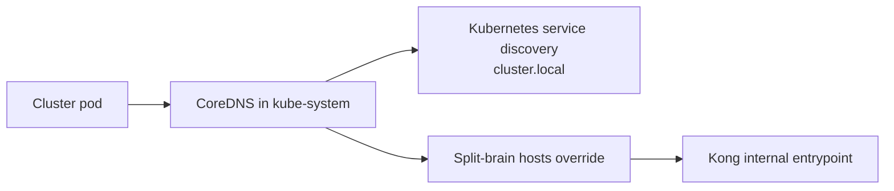
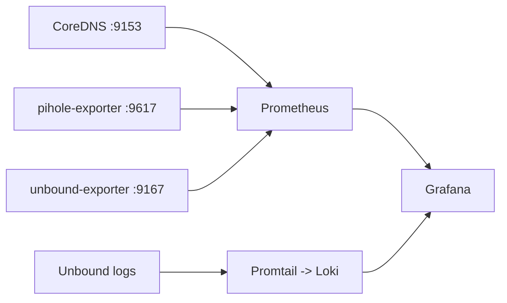

# DNS Architecture

This document describes DNS for Kubernetes workloads and LAN clients.

The DNS stack is split into two planes:

- **In-cluster DNS** - CoreDNS handles `cluster.local` and internal split-brain hostnames.
- **LAN client DNS** - Pi-hole provides filtering, with Unbound as upstream resolver and DNS-over-TLS (DoT) for external resolution.

The Kubernetes DNS capability is a platform component. Pi-hole and Unbound are shared DNS services consumed by LAN clients and workloads.

## Repository layout

Relevant paths:

- `platform/networking/coredns/` - CoreDNS override, metrics service, and notes.
- `platform/observability/` - Grafana, Prometheus, Loki, dashboards, and DNS visibility resources.
- `platform/observability/dns/` - ServiceMonitor resources for DNS components.
- `platform/observability/grafana/` - DNS dashboards.
- `platform/observability/prometheus/` - Prometheus scrape configuration and alert rules.
- `services/dns/pihole/` - Pi-hole deployment, services, storage, secrets, exporters, and policies.
- `services/dns/unbound/` - Unbound deployment, configuration, exporter, and policies.
- `clusters/k8s-homelab/platform/coredns-kustomization.yaml` - dedicated Flux reconciliation for cluster-critical CoreDNS configuration.

## CoreDNS

CoreDNS remains the Kubernetes DNS entrypoint in `kube-system`. It resolves normal Kubernetes service discovery under `cluster.local` and contains a Git-managed `hosts {}` block for split-brain resolution of selected internal hostnames to the Kong internal entrypoint.

The manifest is in `platform/networking/coredns/coredns-configmap.yaml`. Its `${DOMAIN}` and `${KONG_LB_IP}` values are substituted by the dedicated Flux Kustomization before apply.

### In-cluster flow



## Pi-hole and Unbound

Pi-hole is the LAN-facing DNS service. It exposes DNS on UDP/TCP 53 and uses a MetalLB `LoadBalancer` service for LAN access. Pi-hole forwards upstream resolution to Unbound:

```text
LAN client -> Pi-hole -> Unbound -> DoT upstreams
```

Pi-hole configuration uses:

```text
FTLCONF_dns_upstreams=unbound.dns.svc.cluster.local
```

Unbound is restricted to approved DoT egress on TCP/853. This makes encrypted upstream DNS the intended standard rather than inheriting an arbitrary node resolver path.

### LAN flow


## Zero Trust policy model

DNS namespaces operate under deny-by-default with explicit allows.

### Pi-hole namespace

- ingress from LAN clients on TCP/UDP 53;
- ingress from allowed cluster sources where DNS forwarding requires it;
- ingress from Cloudflare Tunnel to the admin interface where configured;
- ingress from observability on exporter port 9617;
- egress to Unbound on TCP/UDP 53;
- HTTPS egress where required for Pi-hole update/list functions.

### DNS namespace

- ingress from Pi-hole on DNS ports;
- ingress from observability on exporter port 9167;
- outbound DoT to explicitly allowed upstream resolver IPs on TCP/853;
- no general plaintext DNS egress to the Internet.

### CoreDNS

CoreDNS is cluster-critical and is treated separately from application namespace policy. Its metrics endpoint is exposed on TCP/9153 for monitoring.

The cluster-wide policy baseline is stored under `platform/networking/network-policies/`.

## Observability

DNS visibility uses Prometheus metrics and Grafana dashboards from `platform/observability/`.

| Component | Metrics source | Port | Primary collection |
|---|---|---:|---|
| CoreDNS | built-in `/metrics` | 9153 | Prometheus / ServiceMonitor |
| Pi-hole | pihole-exporter | 9617 | Prometheus / ServiceMonitor |
| Unbound | unbound-exporter sidecar | 9167 | Prometheus / ServiceMonitor |

DNS dashboards live under `platform/observability/grafana/`; static scrape targets and alerts for the standalone Prometheus instance live under `platform/observability/prometheus/`.



## Design direction

The desired external resolution path is explicit and encrypted:

```text
LAN:       client -> Pi-hole -> Unbound -> DoT
Kubernetes: pod -> CoreDNS -> intentional upstream path
```

Any future CoreDNS upstream redesign must avoid DNS loops and keep the path declarative in Git. It must also preserve the separation between the Kubernetes platform DNS component (`platform/networking/coredns`) and the LAN/shared DNS service (`services/dns`).
