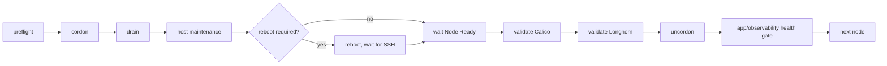

# Future maintenance lifecycle (documented, not yet implemented)

Wave -1 builds the SSH/Ansible/Semaphore/Vault control tower only. It intentionally does
**not** perform any Kubernetes, Arch Linux, Longhorn, Calico/Cilium, kube-vip, or application
version upgrade. This document records the lifecycle model the control tower is being built
to eventually run, so a future wave has a concrete target instead of starting from scratch.

## Ansible execution safety properties (future)

Every maintenance playbook must set:

```yaml
serial: 1
any_errors_fatal: true
max_fail_percentage: 0
```

`serial: 1` processes exactly one node at a time. `any_errors_fatal` + `max_fail_percentage: 0`
mean a single node failure stops the whole run rather than continuing on to damage further
nodes.

## Execution model (future)



## Rules

- Never run `pacman -Syu` on all nodes concurrently — one node at a time, always.
- Never use `kubectl drain --disable-eviction` by default — PDBs exist for a reason.
- Honor PodDisruptionBudgets; do not bypass them without a documented exception.
- Inspect the Longhorn node-drain policy before draining a node that hosts volume replicas.
- Abort the whole run on any degraded Longhorn volume or unhealthy Calico state — do not
  proceed to the next node hoping it self-heals.
- Remember there is exactly **one** control-plane node (`k8s-master01`) in this cluster —
  there is no HA control plane to fall back on if it is mishandled.
- Kubernetes minor version upgrades via kubeadm require control-plane-first ordering, even
  though routine OS maintenance begins with a worker canary. Do not apply the worker-canary
  pattern to a kubeadm minor upgrade.

## Relationship to Wave -1

This maintenance model depends on the control tower built in Wave -1c/-1d: the `ansible`
automation account, Vault-issued short-lived SSH certificates, and Semaphore as the
orchestration surface that will eventually run these playbooks on a schedule or on demand.
None of the maintenance playbooks described here exist yet — implementing them is a
follow-up wave, not part of this one.
