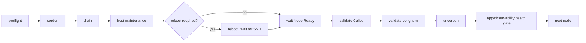

# Homelab maintenance lifecycle

The control tower is operational: GitHub stores desired automation content, SemaphoreUI is the
orchestration surface, Vault issues short-lived SSH client certificates, and Ansible executes
against the nodes. The independent `admin` break-glass route remains recovery-only.

## Mandatory Ansible safety properties

Every mutating maintenance playbook must set:

```yaml
serial: 1
any_errors_fatal: true
max_fail_percentage: 0
```

Never continue to another node after a failed health gate.

## Execution model



## Global rules

- Never run `pacman -Syu` on multiple nodes concurrently.
- Never use partial Arch upgrades such as `pacman -Sy <package>`.
- Never use `kubectl drain --disable-eviction` by default.
- Honor PodDisruptionBudgets; any exception must be deliberate and documented.
- Inspect Longhorn replica placement and node-drain policy before draining a node.
- Abort on degraded Longhorn or unhealthy Calico state.
- The cluster has one control-plane node (`k8s-master01`); there is no HA control-plane fallback.
- Kubernetes minor upgrades via kubeadm use control-plane-first ordering. Ordinary Arch-only
  maintenance begins with a worker canary.

## Wave status

- **Wave -1 — control tower:** complete for operational use. Semaphore -> Vault Kubernetes auth
  -> ephemeral SSH certificate -> `ansible` -> sudo is validated. Break-glass remains independent.
- **Wave 0.5 — maintenance readiness:** implemented as
  `automation/ansible/playbooks/50-maintenance-readiness.yml` and must be run before/after each
  invasive wave. It produces READY / READY WITH ACCEPTED EXCEPTIONS / BLOCKED.
- **Wave 1 — Longhorn:** complete at v1.12.1. See `wave1-longhorn.md`.
- **Wave 2 — Calico:** complete at v3.32.1 with healthy Flux/TigeraStatus/node evidence and a
  post-upgrade readiness verdict with no blockers. See `wave2-calico.md`.
- **Wave 3 — coordinated Arch Linux + Kubernetes:** preparation implemented in
  `playbooks/60-wave3-preflight.yml`; mutation is not approved. See `wave3-arch-kubernetes.md`.
- **Wave 4 — platform components:** pending.
- **Wave 5 — applications:** pending.

## Wave 0.5 readiness gate

The readiness playbook is read-only and covers Kubernetes node/pod/PDB state, Calico,
Longhorn, Flux, host disk/inode/version state and the control-tower trust path. An authoritative
result requires all members of `k8s_homelab`.

Routine invocation:

```text
playbook=playbooks/50-maintenance-readiness.yml
limit=k8s_homelab
```

## Wave 3 preparation gate

Wave 3 is deliberately separated into read-only preparation and later mutation. The preparation
playbook collects Arch package state/candidates, pacman consistency, system-Python diagnostics,
Kubernetes component and kubeadm state, Calico/Longhorn baselines, Longhorn drain/PDB constraints,
and Flux health.

```text
playbook=playbooks/60-wave3-preflight.yml
limit=k8s_homelab
```

The current `v1.36.4` value is only a planning candidate. The live Arch repository and supported
Kubernetes/Calico/Longhorn combination must be revalidated immediately before any operator
approves mutation.

For a combined Arch + Kubernetes window, do not collapse these into one generic node loop:

- Arch-only ordering: worker canary -> remaining workers -> control plane.
- kubeadm minor-version ordering: control plane -> workers one at a time.

Before Wave 3 mutation, explicitly confirm current etcd recovery, Longhorn backups/volume health,
Vault/Semaphore recovery and the independent admin break-glass path.
