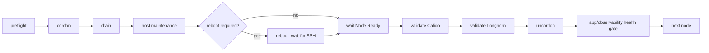

# Future maintenance lifecycle (documented, not yet implemented)

Wave -1 builds the SSH/Ansible/Semaphore/Vault control tower only. It intentionally does
**not** perform any Kubernetes, Arch Linux, Longhorn, Calico/Cilium, kube-vip, or application
version upgrade. This document records the lifecycle model the control tower is being built
to eventually run, so a future wave has a concrete target instead of starting from scratch.

## Ansible execution safety properties (future)

Every maintenance playbook must set:

```yaml
serial: 1
any_errors_fatal: true
max_fail_percentage: 0
```

`serial: 1` processes exactly one node at a time. `any_errors_fatal` + `max_fail_percentage: 0`
mean a single node failure stops the whole run rather than continuing on to damage further
nodes.

## Execution model (future)



## Rules

- Never run `pacman -Syu` on all nodes concurrently — one node at a time, always.
- Never use `kubectl drain --disable-eviction` by default — PDBs exist for a reason.
- Honor PodDisruptionBudgets; do not bypass them without a documented exception.
- Inspect the Longhorn node-drain policy before draining a node that hosts volume replicas.
- Abort the whole run on any degraded Longhorn volume or unhealthy Calico state — do not
  proceed to the next node hoping it self-heals.
- Remember there is exactly **one** control-plane node (`k8s-master01`) in this cluster —
  there is no HA control plane to fall back on if it is mishandled.
- Kubernetes minor version upgrades via kubeadm require control-plane-first ordering, even
  though routine OS maintenance begins with a worker canary. Do not apply the worker-canary
  pattern to a kubeadm minor upgrade.

## Relationship to Wave -1

This maintenance model depends on the control tower built in Wave -1c/-1d: the `ansible`
automation account, Vault-issued short-lived SSH certificates, and Semaphore as the
orchestration surface that will eventually run these playbooks on a schedule or on demand.
None of the maintenance playbooks described here exist yet — implementing them is a
follow-up wave, not part of this one.

## Wave 0.5: maintenance-readiness preflight (implemented)

Before any component upgrade wave runs, the control tower can execute a **read-only**
maintenance-readiness assessment: `automation/ansible/playbooks/50-maintenance-readiness.yml`
(role: `roles/maintenance_readiness/`). It never cordons, drains, reboots, or changes any
Kubernetes, Longhorn, Calico, or Arch package state — it only inspects live state and
produces a verdict.

It reuses the existing generic Semaphore control-tower runner
(`scripts/lifecycle/semaphore-control-tower-run.sh`) — the runner requires no changes because
that script only blocklists the two bootstrap-only playbooks
(`05-control-tower-vault-ca.yml`, `10-control-tower-ssh-accounts.yml`); this playbook is not
one of them. It reuses the same Semaphore -> Vault Kubernetes-auth -> ephemeral SSH
certificate -> Ansible -> sudo path as every other routine playbook — no separate
Vault/SSH logic and no new Kubernetes RBAC/ServiceAccount surface (cluster-API checks read
`k8s-master01`'s own `/etc/kubernetes/admin.conf` via the existing root/sudo trust path).

Coverage: Kubernetes node/pod/PDB health and version skew, single-control-plane risk, Calico
DaemonSet/Deployment/TigeraStatus health and version, Longhorn manager/driver/volume/node
health and drain policy, Flux Kustomization/HelmRelease reconciliation health, host
disk/inode usage and reboot indicators, and control-tower trust-path health.

Each check produces a structured finding (`id`, `component`, `severity`, `observed`,
`evidence`, `impact`, `remediation`, `blocks_next_wave`). The run computes one of three
verdicts:

- **READY** — no blocker or exception findings.
- **READY WITH ACCEPTED EXCEPTIONS** — only exception-severity findings, or blocker findings
  whose `id` is present in `maintenance_readiness_accepted_exceptions`.
- **BLOCKED** — one or more blocker findings not present in
  `maintenance_readiness_accepted_exceptions`. The playbook fails the Ansible run in this
  case so a `BLOCKED` result cannot be silently ignored by automation.

See `roles/maintenance_readiness/README.md` for the full finding-ID catalogue and defaults.

## Future wave sequence

1. **Wave 1 — Longhorn**: manager/system upgrade first, followed by engine upgrades after
   system health is revalidated. This is not an Arch-style node-by-node upgrade. Preparation
   is implemented in `playbooks/55-longhorn-upgrade-preparation.yml`; execution still
   requires a fresh backup gate and explicit approval. See
   [`wave1-longhorn.md`](./wave1-longhorn.md).
2. **Wave 2 — Calico**: CNI upgrade, validated against the current Tigera-operator-managed
   installation.
3. **Wave 3 — coordinated Arch Linux + Kubernetes**: OS package updates and kubeadm/kubelet
   minor version upgrades, control-plane-first ordering for the Kubernetes component.
4. **Wave 4 — platform components**: cluster-wide platform workloads (e.g. observability,
   ingress, cert-manager) reconciled via Flux.
5. **Wave 5 — applications**: application-layer workloads.

Each of these waves must pass the Wave 0.5 readiness gate (or have every blocker explicitly
accepted) before it begins, and must re-run the gate after completion before advancing to the
next wave.
