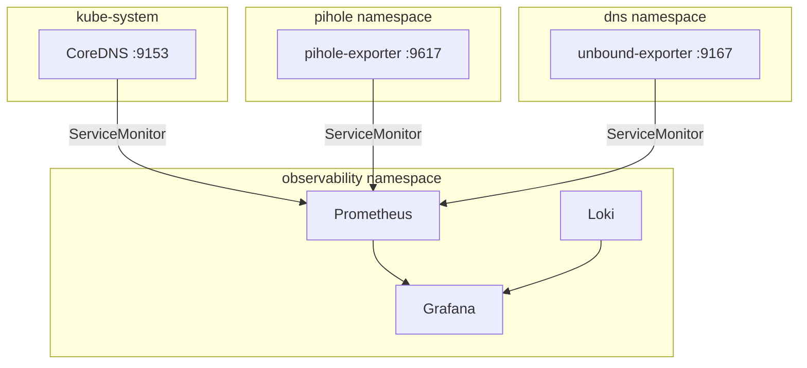

# DNS Observability Implementation

This page documents the DNS visibility implementation in Grafana, Prometheus, and Loki.

## Architecture

The DNS observability layer connects three exporters to Prometheus via ServiceMonitors, with dashboards provisioned in Grafana as ConfigMaps:



## Components

### CoreDNS metrics

CoreDNS already exposes Prometheus metrics on `:9153`. A headless Service in `kube-system` makes the metrics endpoint discoverable, and a ServiceMonitor in `observability` scrapes it.

Manifests:
- `services/dns/pihole/k8s/coredns-metrics-service.yaml` — headless service targeting `k8s-app: kube-dns`
- `infra/observability/dns/coredns-servicemonitor.yaml` — ServiceMonitor

Key metrics:
- `coredns_dns_requests_total` — total query rate
- `coredns_dns_responses_total` — responses by rcode (NOERROR, NXDOMAIN, SERVFAIL)
- `coredns_dns_request_duration_seconds` — latency histogram
- `coredns_cache_hits_total` / `coredns_cache_misses_total` — cache performance

### Pi-hole exporter

The `pihole-exporter` deployment runs in the `pihole` namespace and scrapes the Pi-hole API to expose metrics on port `9617`.

Manifests:
- `services/dns/pihole/k8s/pihole-exporter-deployment.yaml`
- `services/dns/pihole/k8s/pihole-exporter-service.yaml`
- `infra/observability/dns/pihole-servicemonitor.yaml`

Key metrics:
- `pihole_dns_queries_total` — total queries handled
- `pihole_ads_blocked_today` — blocked count
- `pihole_ads_percentage_today` — block percentage
- `pihole_top_queries` — top queried domains
- `pihole_top_ads` — top blocked domains
- `pihole_query_by_type` — query type distribution (A, AAAA, etc.)

### Unbound exporter

The `unbound-exporter` deployment runs in the `dns` namespace and connects to Unbound's `remote-control` interface on port `8953` to expose metrics on port `9167`.

Manifests:
- `services/dns/unbound/k8s/unbound-exporter-deployment.yaml`
- `services/dns/unbound/k8s/unbound-exporter-service.yaml`
- `infra/observability/dns/unbound-servicemonitor.yaml`

Key metrics:
- `unbound_queries_total` — total recursive queries
- `unbound_cache_hits_total` / `unbound_cache_misses_total` — cache performance
- `unbound_response_time_seconds` — upstream resolution latency
- `unbound_answer_rcode_total` — response codes including SERVFAIL
- `unbound_recursion_time_seconds_total` — time spent recursing

## Dashboards

Four DNS-specific Grafana dashboards are provisioned:

| Dashboard | ConfigMap | Purpose |
|-----------|-----------|---------|
| DNS Overview | `grafana-dashboard-dns-overview` | Unified view of all components |
| CoreDNS Health | `grafana-dashboard-coredns` | CoreDNS-specific deep-dive |
| Pi-hole Client Visibility | `grafana-dashboard-pihole` | Client queries, blocked domains |
| Unbound Resolver | `grafana-dashboard-unbound` | Recursive resolution health |

## Alerting

DNS alert rules (in `infra/observability/prometheus/alerts-configmap.yaml`):

| Alert | Condition | Severity |
|-------|-----------|----------|
| CoreDNSErrorRateHigh | SERVFAIL rate >5% for 5m | warning |
| CoreDNSLatencyHigh | p99 latency >500ms for 5m | warning |
| UnboundUpstreamFailures | SERVFAIL rate >1% for 5m | critical |
| PiholeExporterDown | Target absent for 5m | critical |

## Network policy requirements

The observability namespace already has broad Prometheus scrape egress. The target namespaces need ingress rules to allow scraping:

- `pihole` namespace: allow ingress from `observability` on TCP/9617
- `dns` namespace: allow ingress from `observability` on TCP/9167
- `kube-system`: allow ingress from `observability` on TCP/9153

## Repo file layout

```
infra/observability/
├── dns/
│   ├── kustomization.yaml
│   ├── coredns-servicemonitor.yaml
│   ├── pihole-servicemonitor.yaml
│   └── unbound-servicemonitor.yaml
├── grafana/
│   ├── dashboard-dns-overview-configmap.yaml
│   ├── dashboard-coredns-configmap.yaml
│   ├── dashboard-pihole-configmap.yaml
│   └── dashboard-unbound-configmap.yaml
services/dns/
├── pihole/k8s/
│   ├── coredns-metrics-service.yaml
│   ├── pihole-exporter-deployment.yaml
│   └── pihole-exporter-service.yaml
└── unbound/k8s/
    ├── unbound-exporter-deployment.yaml
    └── unbound-exporter-service.yaml
```

