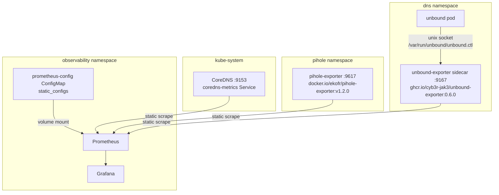

# DNS Observability Implementation

This page documents the DNS visibility implementation in Grafana, Prometheus, and Loki.

## Architecture

The DNS observability layer connects three exporters to Prometheus via **static scrape configs** in the `prometheus-config` ConfigMap. Grafana dashboards are provisioned from ConfigMaps. ServiceMonitor resources also exist in `infra/observability/dns/` but are picked up by the separate kube-prometheus-stack Prometheus in `monitoring` — not the observability-namespace Prometheus.

> **Important**: This stack uses plain Prometheus (not Prometheus Operator). ServiceMonitors are ignored by the observability Prometheus. All scrape targets must be in `infra/observability/prometheus/configmap.yaml`.



## Components

### CoreDNS metrics

CoreDNS already exposes Prometheus metrics on `:9153`. A ClusterIP Service `coredns-metrics` in `kube-system` makes the endpoint discoverable and acts as the static scrape target.

Manifests:
- `infra/coredns/coredns-metrics-service.yaml` — ClusterIP service targeting `k8s-app: kube-dns` on port 9153
- `infra/observability/dns/coredns-servicemonitor.yaml` — ServiceMonitor (consumed by kube-prometheus-stack only)
- Prometheus static job: `coredns-metrics.kube-system.svc.cluster.local:9153`

Key metrics:
- `coredns_dns_requests_total` — total query rate
- `coredns_dns_responses_total` — responses by rcode (NOERROR, NXDOMAIN, SERVFAIL)
- `coredns_dns_request_duration_seconds` — latency histogram
- `coredns_cache_hits_total` / `coredns_cache_misses_total` — cache performance

### Pi-hole exporter

The `pihole-exporter` deployment runs in the `pihole` namespace and scrapes the Pi-hole API to expose metrics on port `9617`.

Image: `docker.io/ekofr/pihole-exporter:v1.2.0` (Docker Hub, no registry auth required)

> **Note**: The image at `ghcr.io/eko/pihole-exporter` is the same author but has **non-public GHCR visibility** — anonymous pulls return `403 Forbidden`. Use Docker Hub. Requires pihole-exporter v1.x for the Pi-hole v6 API.

Manifests:
- `services/dns/pihole/k8s/pihole-exporter-deployment.yaml`
- `services/dns/pihole/k8s/pihole-exporter-service.yaml`
- `services/dns/pihole/k8s/pihole-netpol.yaml` — `allow-prometheus-scrape` ingress on 9617 from `observability`
- `infra/observability/dns/pihole-servicemonitor.yaml` — ServiceMonitor (kube-prometheus-stack only)
- Prometheus static job: `pihole-exporter.pihole.svc.cluster.local:9617`

Key metrics:
- `pihole_dns_queries_total` — total queries handled
- `pihole_ads_blocked_today` — blocked count
- `pihole_ads_percentage_today` — block percentage
- `pihole_top_queries` — top queried domains
- `pihole_top_ads` — top blocked domains
- `pihole_query_by_type` — query type distribution (A, AAAA, etc.)

### Unbound exporter

The `unbound-exporter` runs as a **sidecar container** inside the `unbound` deployment in the `dns` namespace. It connects to Unbound via a **unix socket** (not TCP) and exposes metrics on port `9167`.

Image: `ghcr.io/cyb3r-jak3/unbound-exporter:0.6.0` (public GHCR mirror, requires `ghcr-secret` imagePullSecret)

> **TODO**: Replace with `ghcr.io/ivanversluis/unbound-exporter` once own image is built.

> **Why unix socket**: The exporter binary defaults to loading TLS certs (`/etc/unbound/*.pem`). When `control-use-cert: no` is set in unbound, those certs are never generated. TCP mode fails with "cert file not found". The unix socket avoids TLS entirely: `--unbound.host=unix:///var/run/unbound/unbound.ctl`.

> **Why uid 1000**: Unbound creates the socket as uid 1000 mode 0600. The exporter must run as the same uid or it gets `permission denied`.

Manifests:
- `services/dns/unbound/k8s/unbound-deployment.yaml` — unbound + sidecar, shared `socket` emptyDir volume, both containers uid 1000
- `services/dns/unbound/k8s/unbound-configmap.yaml` — includes `control-interface: /var/run/unbound/unbound.ctl`
- `services/dns/unbound/k8s/unbound-ghcr-externalsecret.yaml` — `ghcr-secret` in `dns` namespace from Vault `infra/argocd`
- `services/dns/unbound/k8s/dns-netpol.yaml` — `allow-prometheus-scrape` ingress on 9167 from `observability`
- `infra/observability/dns/unbound-servicemonitor.yaml` — ServiceMonitor (kube-prometheus-stack only)
- Prometheus static job: `unbound-exporter.dns.svc.cluster.local:9167`

Key metrics:
- `unbound_up` — exporter connectivity check (must be 1)
- `unbound_queries_total` — total recursive queries
- `unbound_cache_hits_total` / `unbound_cache_misses_total` — cache performance
- `unbound_response_time_seconds` — upstream resolution latency
- `unbound_answer_rcode_total` — response codes including SERVFAIL
- `unbound_recursion_time_seconds_total` — time spent recursing

## Prometheus Configuration

Scrape targets are defined as static jobs in `infra/observability/prometheus/configmap.yaml`. After changing this ConfigMap, trigger a reload:

```bash
# Immediate reload (no pod restart needed)
kubectl exec -n observability deploy/prometheus -- wget -qO- http://localhost:9090/-/reload --post-data=

# Or restart the pod (also works)
kubectl rollout restart deployment/prometheus -n observability
```

If the ConfigMap was recently updated by Flux but data is still missing, the Prometheus pod may have started before the ConfigMap was applied (e.g. due to the `kong` dependency blocking observability reconciliation). Restarting the pod is the safe fix.

## Dashboards

Four DNS-specific Grafana dashboards are provisioned:

| Dashboard | ConfigMap | Purpose |
|-----------|-----------|---------|
| DNS Overview | `grafana-dashboard-dns-overview` | Unified view of all components |
| CoreDNS Health | `grafana-dashboard-coredns` | CoreDNS-specific deep-dive |
| Pi-hole Client Visibility | `grafana-dashboard-pihole` | Client queries, blocked domains |
| Unbound Resolver | `grafana-dashboard-unbound` | Recursive resolution health |

## Alerting

DNS alert rules (in `infra/observability/prometheus/alerts-configmap.yaml`):

| Alert | Condition | Severity |
|-------|-----------|----------|
| CoreDNSErrorRateHigh | SERVFAIL rate >5% for 5m | warning |
| CoreDNSLatencyHigh | p99 latency >500ms for 5m | warning |
| UnboundUpstreamFailures | SERVFAIL rate >1% for 5m | critical |
| PiholeExporterDown | Target absent for 5m | critical |

## Network policy requirements

The observability Prometheus has `allow-all` egress (`egress: [{}]`). The target namespaces need ingress rules:

- `pihole` namespace: `allow-prometheus-scrape` allows ingress from `observability` on TCP/9617 to `app.kubernetes.io/name: pihole-exporter`
- `dns` namespace: `allow-prometheus-scrape` allows ingress from `observability` on TCP/9167 to `app.kubernetes.io/name: unbound`
- `kube-system`: excluded from the Calico GlobalNetworkPolicy default-deny — no extra policy needed for CoreDNS :9153

## Repo file layout

```
infra/observability/
├── prometheus/
│   ├── configmap.yaml              # static_configs for ALL scrape targets — edit this to add new targets
│   └── alerts-configmap.yaml       # alerting rules
├── grafana/
│   ├── dashboard-dns-overview-configmap.yaml
│   ├── dashboard-coredns-configmap.yaml
│   ├── dashboard-pihole-configmap.yaml
│   └── dashboard-unbound-configmap.yaml
└── dns/
    ├── coredns-servicemonitor.yaml    # consumed by kube-prometheus-stack (monitoring ns) only
    ├── pihole-servicemonitor.yaml     # consumed by kube-prometheus-stack (monitoring ns) only
    └── unbound-servicemonitor.yaml    # consumed by kube-prometheus-stack (monitoring ns) only

infra/coredns/
└── coredns-metrics-service.yaml       # ClusterIP svc in kube-system on :9153

services/dns/
├── pihole/k8s/
│   ├── pihole-exporter-deployment.yaml  # docker.io/ekofr/pihole-exporter:v1.2.0
│   ├── pihole-exporter-service.yaml     # ClusterIP on :9617
│   └── pihole-netpol.yaml               # includes allow-prometheus-scrape
└── unbound/k8s/
    ├── unbound-deployment.yaml          # unbound + sidecar ghcr.io/cyb3r-jak3/unbound-exporter:0.6.0
    ├── unbound-configmap.yaml           # includes unix socket remote-control
    ├── unbound-exporter-service.yaml    # ClusterIP on :9167
    ├── unbound-ghcr-externalsecret.yaml # ghcr-secret from Vault infra/argocd
    └── dns-netpol.yaml                  # includes allow-prometheus-scrape
```

