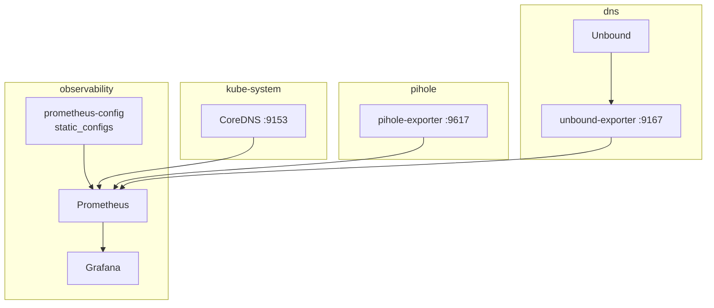

# Observability Architecture

This page documents the metrics, logs, dashboards, and DNS visibility implementation.

## Platform location

Observability is a Kubernetes platform capability and is stored under:

```text
platform/observability/
├── prometheus/           # standalone Prometheus and static scrape config
├── grafana/              # dashboards, datasource, OIDC configuration
├── loki/                 # log aggregation
├── promtail/             # node log shipping
├── dns/                  # ServiceMonitors for DNS components
├── vault/                # ExternalSecret consumers for observability secrets
└── monitoring/           # kube-prometheus-stack, metrics-server, Gatus, MikroTik proxy
```

The two Prometheus planes are intentionally distinct:

- `observability` namespace: a **plain Prometheus** deployment using static `scrape_configs` from `platform/observability/prometheus/configmap.yaml`.
- `monitoring` namespace: kube-prometheus-stack/Prometheus Operator, which consumes `ServiceMonitor` CRDs.

Moving both deployment units below `platform/observability/` changes repository ownership only; it does not merge their runtime behavior.

## DNS observability

The DNS layer connects CoreDNS, Pi-hole, and Unbound exporters to Prometheus.



### CoreDNS

- Metrics Service: `platform/networking/coredns/coredns-metrics-service.yaml`
- ServiceMonitor: `platform/observability/dns/coredns-servicemonitor.yaml`
- Static target: `coredns-metrics.kube-system.svc.cluster.local:9153`

### Pi-hole

- Exporter deployment/service remain with the shared service under `services/dns/pihole/k8s/`.
- ServiceMonitor: `platform/observability/dns/pihole-servicemonitor.yaml`
- Static target: `pihole-exporter.pihole.svc.cluster.local:9617`

### Unbound

- Exporter remains a sidecar in `services/dns/unbound/k8s/unbound-deployment.yaml`.
- The sidecar uses `unix:///var/run/unbound/unbound.ctl` and runs as uid 1000 to match the Unbound control socket ownership.
- ServiceMonitor: `platform/observability/dns/unbound-servicemonitor.yaml`
- Static target: `unbound-exporter.dns.svc.cluster.local:9167`

## Standalone Prometheus

Static scrape jobs are defined in:

```text
platform/observability/prometheus/configmap.yaml
```

`ServiceMonitor` resources do not configure this Prometheus instance. They are consumed by the separate kube-prometheus-stack instance under `platform/observability/monitoring/`.

After changing the standalone Prometheus ConfigMap, reload or restart Prometheus:

```bash
kubectl exec -n observability deploy/prometheus -- \
  wget -qO- http://localhost:9090/-/reload --post-data=

# or
kubectl rollout restart deployment/prometheus -n observability
```

## Dashboards and alerting

DNS dashboards are provisioned from ConfigMaps under `platform/observability/grafana/`:

- DNS Overview
- CoreDNS Health
- Pi-hole Client Visibility
- Unbound Recursive Resolver

Alert rules are stored in `platform/observability/prometheus/alerts-configmap.yaml` and cover CoreDNS error/latency conditions plus Pi-hole and Unbound exporter/upstream failures.

## Network-policy requirements

The observability data plane depends on explicit policy allows:

- `observability` -> `pihole` TCP/9617;
- `observability` -> `dns` TCP/9167;
- `observability` -> `kube-system` TCP/9153;
- required egress from the monitoring/observability components according to their manifests.

The cluster-wide policy baseline is in `platform/networking/network-policies/`.

## Flux reconciliation

The standalone observability stack is reconciled through:

```text
clusters/k8s-homelab/platform/observability-kustomization.yaml
```

The kube-prometheus-stack monitoring plane is reconciled through:

```text
clusters/k8s-homelab/platform/monitoring-kustomization.yaml
```

`monitoring-kong-consumers-kustomization.yaml` remains a separate dependency boundary so Kong consumer resources are not applied before their ExternalSecret-generated credential exists.

## Operational rule

When adding a platform-wide telemetry capability, place its manifests under `platform/observability/`. Exporters that are tightly coupled to a service remain with that service; their scrape/discovery configuration belongs to the observability platform.
